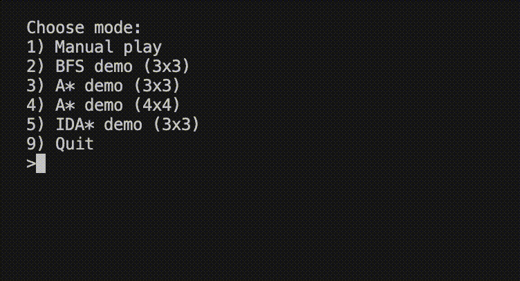

# Sliding Number Puzzle Solver

## Overview
A Python-based sliding puzzle solver with configurable board sizes, manual play, and automated solving with BFS (Breadth-First Search), A* (Manhattan), and IDA* (Manhattan). Features a visual terminal playback of solutions, benchmarking tools that log solver performance to CSV and generate Markdown summary tables.



## Features
- Supports any [n×n] board size
- Solvability checks for both odd and even board sizes  
- Manual play mode with `u/d/l/r` controls and reshuffle with `x` 
- `BFS` solver: [3×3] with optimal path reconstruction
- `A*` (Manhattan) solver: [3×3] and [4×4] with optimal path reconstruction
- `IDA*` (Manhattan) solver: [3×3] with optimal path reconstruction
- Animated terminal playback: run BFS, A*, or IDA* in the same demo
- Benchmarking scripts to produce CSV data and Markdown summaries
- Unit tests for board logic and solvers

## Results at a Glance

### [3×3] — BFS vs A* (Manhattan) vs IDA* (Manhattan)

**Avg Time (ms)**

| Depth (N) | BFS | A* (Manhattan) | IDA* (Manhattan) |
| ---: | :---: | :---: | :---: |
| 20 | 166.495 | 1.502 | 3.576 |
| 40 | 621.334 | 7.810 | 26.735 |
| 60 | 490.556 | 4.354 | 12.637 |

**Avg States Expanded**

| Depth (N) | BFS | A* (Manhattan) | IDA* (Manhattan) |
| ---: | :---: | :---: | :---: |
| 20 | 22,955 | 145 | 705 |
| 40 | 83,398 | 672 | 4,823 |
| 60 | 66,760 | 387 | 2,447 |

**Avg Peak Memory (KB)**

| Depth (N) | BFS | A* (Manhattan) | IDA* (Manhattan) |
| ---: | :---: | :---: | :---: |
| 20 | 7938.66 | 38.69 | 4.50 |
| 40 | 24,739.04 | 183.72 | 5.13 |
| 60 | 20,114.39 | 96.21 | 5.14 |

> Full tables: [BFS 3×3](docs/bfs[3x3]_summary_2025-08-14.md) · [A\* 3×3](docs/astar[3x3]_summary_2025-08-14.md) · [IDA* 3×3](docs/idastar[3x3]_summary_2025-08-14.md)

### [4×4] — A* (Manhattan)

| Depth (N) | Avg Time (ms) | Avg States Expanded | Avg Peak Memory (KB) |
|----------:|--------------:|--------------------:|---------------------:|
| 20        | 1.335         | 98                  | 33.73                |
| 40        | 240.417       | 12,455              | 9,272.05             |
| 60        | 4,666.924     | 221,565             | 162,034.14           |

> Full table: [A\* 4×4](docs/astar[4x4]_summary_2025-08-14.md)

## How to Run

### Manual Play and Visual Solver Playback

```bash
python main.py
```
At the prompt, choose:
- **1** — Manual play  
- **2** — BFS demo [3×3]
- **3** — A* demo [3×3]
- **4** — A* demo [4×4]
- **5** — IDA* demo [3×3]

---

### Benchmarking

**BFS, A*, IDA\***
1. Modify benchmark parameters to desired settings.
2. Run the benchmark:
```bash
python scripts/benchmark_<solver>.py
```
3. Modify generate_summary to desired settings.
4. Run the summary:
```bash
python scripts/generate_summary.py
```
The summary table will be written to:
```
docs/<solver>[n×n]_summary_<date>.md
```

---

### Tests
Run all tests with:
```bash
pytest -q
```
Tests cover:
- Board methods
- BFS path reconstruction
- A*/IDA* expected lengths on trivials and parity with BFS on small solvable cases

## Benchmark Results
- BFS 3×3 results: see [`docs/bfs[3x3]_summary_<date>.md`](docs/bfs[3x3]_summary_2025-08-14.md).
- A* 3×3 results: see [`docs/astar[3x3]_summary_<date>.md`](docs/astar[3x3]_summary_2025-08-14.md).
- A* 4×4 results: see [`docs/astar[4x4]_summary_<date>.md`](docs/astar[4x4]_summary_2025-08-14.md).
- IDA* 3×3 results: see [`docs/idastar[3x3]_summary_<date>.md`](docs/idastar[3x3]_summary_2025-08-14.md).

## Roadmap
- ~~A* solver with Manhattan distance heuristic [3×3]~~ - Done: v1.1.0
- ~~IDA* solver with Manhattan distance heuristic [3×3]~~ - Done: v1.2.0
- Linear Conflict heuristic (A*), then Pattern Database (PDB)  

## Version History
- **v1.2.0** - IDA* (Manhattan) solver for [3×3] and peak memory usage tracking
- v1.1.0 - A* (Manhattan) solver, unified playback, A* 3×3 & 4×4 benchmarks
- v1.0.0 — First solver release: BFS solver with CLI playback and benchmarking tools  
- v0.2 - Playable version with manual moves and terminal display
- v0.1 - Foundation: board generation, display, solvability check, shuffle with safeguards

## License
MIT License

## Author
**Jonathan Pereda**
[GitHub](https://github.com/jonathanpereda)